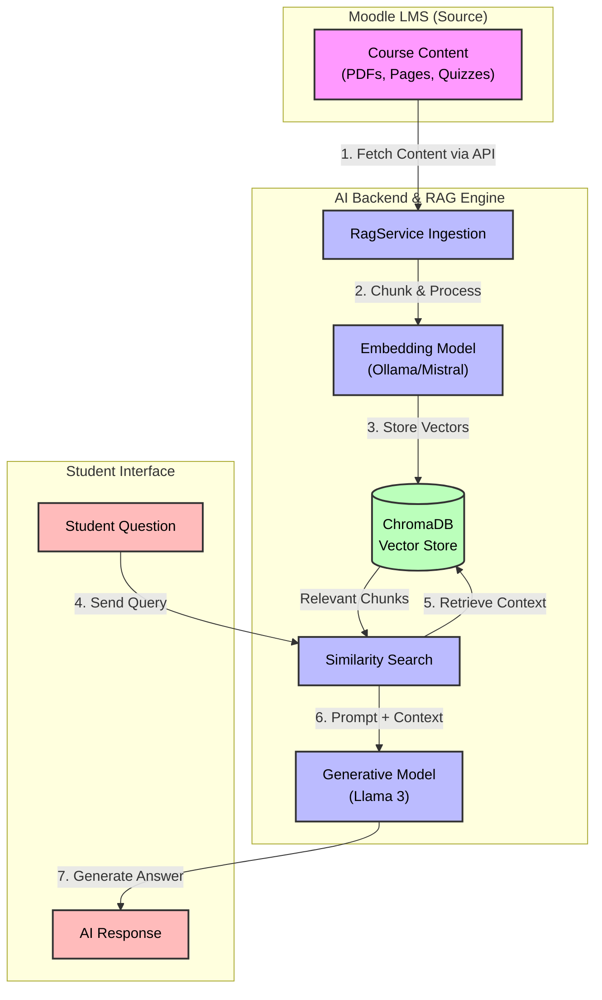

# Project Features Documentation: Teacher-Tutor Generative AI using LangChain

This document presents the features of the "Teacher-Tutor Generative AI" project, organized into three key phases: Moodle LMS Integration, Generative AI & RAG Development, and Moodle Plugin Integration.

---

## 1. Moodle LMS Integration and Familiarization

### Overview
The foundation of the personalized learning system is a robust Learning Management System (LMS). This phase focused on establishing a production-ready Moodle environment to host course content, manage users, and track student progress.

### Key Features
*   **Production Deployment**: Fully functional Moodle LMS hosted at `https://bcccs.octanity.net/lms/`.
*   **Course Structure**: Development of comprehensive course modules (e.g., "Introduction to AI Tutor") containing structured learning resources, quizzes, and assignments.
*   **User Management**: Configuration of distinct roles for Administrators, Teachers, and Students to ensure proper access control.
*   **Data Verification**: Validation of database schemas to ensure reliable retrieval of user enrollments, grades, and activity logs.

### Visuals

> **[Screenshot Placeholder 1: Moodle LMS Homepage]**  
> *Insert a screenshot of the `https://bcccs.octanity.net/lms/` homepage showing the active courses and general interface.*

> **[Screenshot Placeholder 2: Course Structure View]**  
> *Insert a screenshot of a specific course page displaying topics, quizzes, and uploaded learning resources.*

---

## 2. Generative AI Model Research & RAG App Development

### Overview
This phase involved building the "Brain" of the system—a Retrieval-Augmented Generation (RAG) engine. The system is designed to provide personalized tutoring by retrieving relevant context exclusively from the Moodle course materials, ensuring accurate and curriculum-aligned responses.

### Key Features
*   **RAG Architecture**:
    *   **Content Ingestion**: Implemented `RagService` to securely fetch and process course materials (PDFs, Pages) from Moodle.
    *   **Vector Storage**: Integrated **ChromaDB** for efficient storage and semantic retrieval of course content embeddings.
    *   **AI Models**: Utilizes **Groq (Llama 3)** for high-speed inference and **Ollama (Mistral)** for local embeddings.
*   **Personalized Learning Engine**:
    *   **Study Plan Generation**: Analyzes student performance data (quizzes, grades) to generate custom study plans, highlighting weaknesses and recommending specific modules.
    *   **Context-Aware Responses**: AI responses are tailored to the specific course context and the individual student's learning history.
*   **Teacher Dashboard**:
    *   **Real-time Analytics**: A React-based dashboard that pulls live student data via the Moodle Web Service API.
    *   **Role-Based Filtering**: Logic to strictly separate student performance data from staff/admin roles.
    *   **Pop Quiz System**: AI-generated quizzes to test student understanding, with results persisted for analytics.

### Visuals

![RAG Architecture Diagram](https://mermaid.ink/img/Z3JhcGggVEQKICAgICUlIFN0eWxpbmcKICAgIGNsYXNzRGVmIG1vb2RsZSBmaWxsOiNmOWYsc3Ryb2tlOiMzMzMsc3Ryb2tlLXdpZHRoOjJweCxjb2xvcjpibGFjazsKICAgIGNsYXNzRGVmIGJhY2tlbmQgZmlsbDojYmJmLHN0cm9rZTojMzMzLHN0cm9rZS13aWR0aDoycHgsY29sb3I6YmxhY2s7CiAgICBjbGFzc0RlZiBkYiBmaWxsOiNiZmIsc3Ryb2tlOiMzMzMsc3Ryb2tlLXdpZHRoOjJweCxjb2xvcjpibGFjazsKICAgIGNsYXNzRGVmIGZyb250ZW5kIGZpbGw6I2ZiYixzdHJva2U6IzMzMyxzdHJva2Utd2lkdGg6MnB4LGNvbG9yOmJsYWNrOwoKICAgIHN1YmdyYXBoIE1vb2RsZUxNUyBbIk1vb2RsZSBMTVMgKFNvdXJjZSkiXQogICAgICAgIGRpcmVjdGlvbiBUQgogICAgICAgIENvbnRlbnRbIkNvdXJzZSBDb250ZW50PGJyLz4oUERGcywgUGFnZXMsIFF1aXp6ZXMpIl06Ojptb29kbGUKICAgIGVuZAoKICAgIHN1YmdyYXBoIEFJX0JhY2tlbmQgWyJBSSBCYWNrZW5kICYgUkFHIEVuZ2luZSJdCiAgICAgICAgZGlyZWN0aW9uIFRCCiAgICAgICAgSW5nZXN0WyJSYWdTZXJ2aWNlIEluZ2VzdGlvbiJdOjo6YmFja2VuZAogICAgICAgIEVtYmVkWyJFbWJlZGRpbmcgTW9kZWw8YnIvPihPbGxhbWEvTWlzdHJhbCkiXTo6OmJhY2tlbmQKICAgICAgICBWZWN0b3JEQlsoIkNocm9tYURCPGJyLz5WZWN0b3IgU3RvcmUiKV06OjpkYgogICAgICAgIFJldHJpZXZlclsiU2ltaWxhcml0eSBTZWFyY2giXTo6OmJhY2tlbmQKICAgICAgICBMTE1bIkdlbmVyYXRpdmUgTW9kZWw8YnIvPihMbGFtYSAzKSJdOjo6YmFja2VuZAogICAgZW5kCgogICAgc3ViZ3JhcGggU3R1ZGVudFVJIFsiU3R1ZGVudCBJbnRlcmZhY2UiXQogICAgICAgIFF1ZXJ5WyJTdHVkZW50IFF1ZXN0aW9uIl06Ojpmcm9udGVuZAogICAgICAgIFJlc3BvbnNlWyJBSSBSZXNwb25zZSJdOjo6ZnJvbnRlbmQKICAgIGVuZAoKICAgICUlIERhdGEgSW5nZXN0aW9uIEZsb3cKICAgIENvbnRlbnQgLS0-fDEuIEZldGNoIENvbnRlbnQgdmlhIEFQSXwgSW5nZXN0CiAgICBJbmdlc3QgLS0-fDIuIENodW5rICYgUHJvY2Vzc3wgRW1iZWQKICAgIEVtYmVkIC0tPnwzLiBTdG9yZSBWZWN0b3JzfCBWZWN0b3JEQgoKICAgICUlIFF1ZXJ5ICYgUmVzcG9uc2UgRmxvdwogICAgUXVlcnkgLS0-fDQuIFNlbmQgUXVlcnl8IFJldHJpZXZlcgogICAgUmV0cmlldmVyIC0tPnw1LiBSZXRyaWV2ZSBDb250ZXh0fCBWZWN0b3JEQgogICAgVmVjdG9yREIgLS0gUmVsZXZhbnQgQ2h1bmtzIC0tPiBSZXRyaWV2ZXIKICAgIFJldHJpZXZlciAtLT58Ni4gUHJvbXB0ICsgQ29udGV4dHwgTExNCiAgICBMTE0gLS0-fDcuIEdlbmVyYXRlIEFuc3dlcnwgUmVzcG9uc2U=)


    %% Styling
    classDef moodle fill:#f9f,stroke:#333,stroke-width:2px,color:black;
    classDef backend fill:#bbf,stroke:#333,stroke-width:2px,color:black;
    classDef db fill:#bfb,stroke:#333,stroke-width:2px,color:black;
    classDef frontend fill:#fbb,stroke:#333,stroke-width:2px,color:black;

    subgraph MoodleLMS ["Moodle LMS (Source)"]
        direction TB
        Content[Course Content<br/>(PDFs, Pages, Quizzes)]:::moodle
    end

    subgraph AI_Backend ["AI Backend & RAG Engine"]
        direction TB
        Ingest[RagService Ingestion]:::backend
        Embed[Embedding Model<br/>(Ollama/Mistral)]:::backend
        VectorDB[(ChromaDB<br/>Vector Store)]:::db
        Retriever[Similarity Search]:::backend
        LLM[Generative Model<br/>(Llama 3)]:::backend
    end

    subgraph StudentUI ["Student Interface"]
        Query[Student Question]:::frontend
        Response[AI Response]:::frontend
    end

    %% Data Ingestion Flow
    Content -->|1. Fetch Content via API| Ingest
    Ingest -->|2. Chunk & Process| Embed
    Embed -->|3. Store Vectors| VectorDB

    %% Query & Response Flow
    Query -->|4. Send Query| Retriever
    Retriever -->|5. Retrieve Context| VectorDB
    VectorDB -- Relevant Chunks --> Retriever
    Retriever -->|6. Prompt + Context| LLM
    LLM -->|7. Generate Answer| Response
```

> **[Screenshot Placeholder 4: AI Chat Interface]**  
> *Insert a screenshot of the chat interface showing the AI answering a student's question based on course material.*

> **[Screenshot Placeholder 5: Teacher Dashboard - Student Analytics]**  
> *Insert a screenshot of the dashboard showing class averages and filtered student performance lists.*

> **[Screenshot Placeholder 6: Personalized Learning Path Modal]**  
> *Insert a screenshot of the "View Plan" modal displaying identified weaknesses and the AI-generated study plan.*

---

## 3. Moodle Plugin and API Integration

### Overview
The final phase focuses on seamlessly embedding the AI capabilities into the Moodle environment. This ensures that students and teachers can access the AI Tutor and Dashboard directly within their familiar course interface without needing to log in to a separate external application.

### Key Features
*   **Moodle Block Plugin (`block_ai_tutor`)**:
    *   **Custom Sidebar Block**: A dedicated "AI Tutor" block integrated into the Moodle course interface.
    *   **IFrame Embedding**: Securely embeds the React frontend within Moodle.
    *   **Context Propagation**: Automatically passes critical context (Course ID, Student ID, User Role) to the AI application via secure parameters.
*   **Navigation & UX Enhancements**:
    *   **Global Navigation Link**: Injected "AI Personal Tutor" link into the global course "More" menu via the `local_ai_tutor` plugin.
    *   **Role-Based Redirection**: Teachers are automatically directed to the Dashboard view, while Students are directed to the Chat Interface.
    *   **Full-Screen Mode**: A dedicated `view.php` page that offers a distraction-free, full-screen view of the AI Tutor.
*   **Backend Integration**:
    *   **Web Services Setup**: Automated service creation and token generation via `setup_services.php`.
    *   **Data Synchronization**: Real-time fetching of enrolled users and grades, and on-demand ingestion of course content updates.

### Visuals

> **[Screenshot Placeholder 7: Moodle Course with AI Tutor Block]**  
> *Insert a screenshot of a Moodle course page showing the "AI Tutor" block in the sidebar.*

> **[Screenshot Placeholder 8: Full-Screen AI Tutor View]**  
> *Insert a screenshot of the `view.php` page showing the full-screen interface, demonstrating either the Chat or Dashboard view.*
